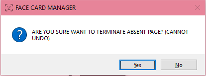

# **Perkembangan Prototype:**

### 1) **Prototype Figma**

Kami menyediakan prototype program berupa UI Design dalam website Figma yang dapat diakses dalam link ini:

<https://www.figma.com/proto/jcb0Va0Ef6gTKnrDrZJKfX/FACE-CARD?node-id=1%3A9&scaling=contain&page-id=0%3A1&starting-point-node-id=1%3A9>

Prototype Figma dibuat untuk mempermudah pembuatan program, dan membuat user atau pengguna awam mengerti *flow* aplikasi dari FACECARD, yaitu: login, menambahkan siswa, menambahkan kelas, menambahkan siswa ke dalam kelas yang dipilih, menambahkan sesi baru di kelas yang dipilih, memilih sesi yang sudah ditambahkan untuk melihat absensi yang sudah selesai atau memulai scanning untuk absensi siswa.

---

### 2) **Hal-hal yang perlu disiapkan untuk mengakses program prototype**

Ada beberapa hal yang harus disiapkan terlebih dahulu untuk menjalankan program FACECARD yang sudah tim kami buat. Berikut merupakan langkah-langkah dan program apa saja yang harus dipasang dalam perangkat komputer, yang kami sarankan menggunakan OS Windows 10 dan memori yang cukup untuk menjalankan program secara maksimal. Kami sarankan untuk menggunakan perangkat dengan memori minimal 4 GB dengan ruang penyimpanan minimal 12 GB untuk menginstall semua perangkat dari awal. User juga akan membutuhkan perangkat webcam untuk melakukan absensi menggunakan face recognition yang sudah kami buat.

1) **Python** 

Python adalah bahasa pemrograman yang digunakan untuk membuat prototype kami. Oleh karena itu, untuk mengcompile prototype yang sudah kami buat maka user harus menginstall python terlebih dahulu, dengan minimal versi 3.9.6. Perlu diperhatikan bahwa versi ini tidak dapat digunakan di perangkat dengan Windows 7 kebawah.

Pertama, download installer python di link berikut: 
<https://www.python.org/downloads/>


Klik tombol “Download Python 3.x.x” untuk mengunduh versi terbaru dari python. Jika anda hanya ingin menginstall python sesuai dengan versi yang kami gunakan, maka dapat diunduh di link berikut: 
<https://www.python.org/downloads/release/python-396/>


Scroll kebagian files dan download sesuai dengan device anda (Windows Installer 32/64 bit).

Jalankan executable yang sudah didownload untuk memulai instalasi python.


Pilih opsi “Install Now”, dan jangan lupa untuk mencentang “Add Python 3.x to PATH”. Instalasi akan dimulai dan akan diberi notifikasi instalasi berhasil ketika python sudah terpasang di perangkat anda.


Jangan lupa untuk mengecek kembali PATH anda, yaitu dengan mengakses “Edit the system environment variables” pada windows anda.


Tekan tombol “environment variables”


Pilih Path pada System Variables


Pastikan Python versi anda sudah ada di dalam PATH, jika belum, klik tombol “New” dan arahkan ke folder dimana Python anda di-install (folder Scripts). Untuk mengecek versi python yang anda miliki di perangkat anda, jalankan perintah `python –version` di command prompt anda.


2) **PIP for Python**

PIP merupakan tools terbaik untuk menginstall packages dalam python. Untuk menggunakannya, user haru mendownload pip terlebih dahulu di link berikut:
<https://bootstrap.pypa.io/get-pip.py>

Anda dapat mengklik kanan website tersebut, dan tekan tombol “Save as..” untuk mendownload file get-pip.py. Setelah itu, buka command prompt atau windows PowerShell di direktori di mana get-pip.py diunduh. Lalu, jalankan command berikut:

```python get-pip.py```


Instalasi PIP akan dimulai. Setelah mendapatkan line yang mengatakan instalasi sukses dan sudah selesai, anda dapat menjalankan command `pip -V` untuk mengecek versi PIP anda. 


Jika terminal anda menampilkan versi PIP seperti gambar diatas, maka PIP sudah dapat digunakan.

3) **Cmake**

Karena program kami menggunakan dlib yang dikembangkan melalui bahasa C, maka Cmake dibutuhkan untuk menjalankan dlib tersebut. Download cmake di link berikut: 
<https://cmake.org/download/>


Pilih windows installer sesuai dengan perangkat anda. File yang akan terunduh akan berbentuk .msi, run program tersebut dan ikuti langkah-langkahnya. Jangan lupa untuk mencentang “Add CMake to the system PATH for all users”.


Setelah itu, kita perlu memeriksa atau menambahkan PATH cmake kedalam perangkat kita, di menu environment variables. Kali ini, kita mengubah PATH dalam user variable.


Pastikan CMake sudah terdapat dalam PATH, seperti pada gambar berikut:


Jika belum, anda dapat menekan tombol “New” dan arahkan ke folder bin dimana CMake anda install.

4) **Visual Studio**

Karena dlib menggunakan bahasa C, selain harus mengunduh Cmake, kita juga harus menginstall compiler berupa Visual Studio yang dapat diunduh di link berikut:
<https://visualstudio.microsoft.com/visual-cpp-build-tools/>

Ikuti langkah-langkah yang diberikan Visual Studio untuk menginstall Build Tools Visual Studio. Jangan lupa untuk menginstall package untuk C dan C++, yaitu Packages CMake tools for Windows.


C++ CMake tools for Windows tidak boleh dilewatkan disini. Setelah instalasi selesai, anda dapat memeriksanya kembali di Modify > Individual Components > Compilers, build tools, and runtimes > C++ CMake tools for Windows.


Klik tombol install jika belum didapati C++ CMake tools for Windows.

5) **Download source code FACECARD**

Source code untuk menjalankan program ini dapat diakses dari link berikut:

<https://github.com/jptriciaestella/face_card.git>


Untuk mendownload code dalam github, maka anda dapat menekan tombol code hijau dan pilih opsi “Download ZIP”. Pilih direktori yang anda inginkan untuk menyimpan program ini.

Ketika FACECARD-main.zip sudah terdownload, maka anda dapat extract file tersebut agar bisa mengakses folder dan file yang dibutuhkan dalam program FACECARD kami.

6) **Install requirements.txt**

Untuk menjalankan program, kita harus menginstall beberapa library lain di dalam python yang sudah kami tuliskan dalam requirements.txt. Library tambahan yang akan digunakan antara lain tkcalendar untuk membuat calendar, cmake yang sudah di*download* sebelumnya, dlib dan opencv sebagai deep learning, face-recognition untuk algoritma face recognition yang digunakan, dan library lainnya untuk membuat UI sesuai dengan prototype yang digambarkan. 

Oleh karena itu, user dapat membuka command prompt ataupun windows PowerShell di direktori face\_card anda. Hal ini dapat dilakukan dengan perintah **cd <alamat face\_card>** ataupun menekan tombol shift+klik kanan di direktori face card. 


dan jalankan perintah berikut: 

```pip install -r requirements.txt```


Tunggu sampai semua library dan packages terinstall dengan benar, pastikan komputer anda terhubung dengan koneksi internet yang baik.

---

### 3) **Program Prototype**

Untuk menjalankan program, jalankan powershell di direktori facecard, dan jalankan perintah berikut:

```
cd ui

python main.py
```


Jika semua instalasi sudah dilakukan dengan benar, maka akan muncul pop-up window aplikasi FACECARD yang siap digunakan.


Note: Prototype ini belum mengaplikasikan design yang responsif, sehingga window belum bisa di-*resize* ataupun memasuki mode *full-screen*.

**Langkah penggunaan program ini adalah sebagai berikut:**

1) **Login**

User perlu memasukkan username dan password dari admin yang mengatur absensi mahasiswa. Kami menyediakan beberapa kombinasi username dengan password sebagai berikut:


|**Username**|**Password**|
| :-: | :-: |
|Admin|Admin|
|teacher|Password|
|a|a|

Jika user tidak mengisi form atau memasukan kombinasi yang salah, maka program akan mengeluarkan pesan error dan mengulangi permintaannya lagi.


Jika kombinasi benar, maka user akan diarahkan ke laman utama aplikasi, berjudul MANAGE DATA dengan tampilan sebagai berikut:


User dapat menekan tombol logout untuk keluar dari akun dan menutup halaman ini.

2) **Add Student**

Data siswa adalah data pertama yang perlu ditambahkan ke dalam database program ini. Dengan menekan tombol “Add Student Data” di halaman utama, maka user akan ditampilkan halaman untuk mengisi data siswa sebagai berikut:


Halaman ini diisi dengan foto siswa, nama, nomor mahasiswa, tanggal lahir, dan nomor telepon. Halaman ini dapat disesuaikan dengan kebutuhan data lainnya yang dibutuhkan oleh lembaga administrasi universitas yang berlangganan. Pastikan foto yang diunggah jelas wajahnya, tidak tertutup atribut apapun dan menghadap ke kamera.


Setelah mengisi data dengan benar, tekan tombol “Save Data” untuk menyimpan data tersebut. Aplikasi akan menampilkan pemberitahuan “Student Added!” jika berhasil menambahkan data dengan benar.

Ulangi langkah ini untuk setiap siswa yang akan terlibat di perkuliahan.

3) **Class Schedule**

Setiap menambahkan siswa, program akan mengembalikan user ke halaman utama. Untuk melihat setiap kelas yang ada, user dapat memilih tombol kedua yaitu “Class Schedule”. Tampilan pertama halaman ini adalah sebagai berikut:


Tabel class yang ada akan kosong karena secara default database perkuliahan kosong. Oleh karena itu, user dapat menambahkan kelas-kelas yang dibutuhkan dalam perkuliahan dengan menekan tombol “Add New”. Program akan menampilkan form pengisian kelas baru seperti gambar berikut:


Setelah mengisi form dengan benar, maka program akan memunculkan pemberitahuan “Class Added!” yang menandakan kelas berhasil ditambahkan. Program akan kembali ke halaman sebelumnya, dan menampilkan kelas yang baru ditambahkan. Ulangi proses ini untuk setiap kelas yang dibutuhkan.


Perlu diingat bahwa kode kelas merupakan *key* yang akan digunakan oleh program, dan tidak dapat menambahkan kelas baru dengan kode yang sama. Jika dilakukan, akan muncul pemberitahuan seperti ini:


4) **Add Student to the Selected Class**

Ketika user telah menambahkan kelas-kelas yang dibutuhkan, saatnya mendaftarkan atau meng-*enroll* siswa yang sudah ada ke dalam kelas tersebut. Caranya, di halaman manage class schedule, user dapat memilih kelas yang diinginkan dan lakukan double klik untuk masuk ke detail kelas tersebut.


Halaman detail class adalah sebagai berikut:


Kelas yang baru dibuat tidak akan memiliki siswa yang terdaftar di dalamnya. Oleh karena itu, user dapat menekan tombol “Add Student”.


Program akan menampilkan seluruh siswa yang ada di database, yang belum terdaftar di kelas terpilih. Untuk menambahkannya, cukup pilih siswa yang diinginkan dan tekan tombol “Add”. Sama seperti menu lainnya, bar “Search…” dapat memudahkan user dalam mencari data yang diinginkan.


Siswa yang dipilih akan masuk ke database kelas tersebut, dan program akan me-*refresh* halaman ini, dan menampilkan seluruh siswa yang ada dikurangi dengan siswa yang sudah ada di kelas. Tambahkan sampai jumlah siswa di kelas tersebut sesuai.


Jika user menekan tombol back, maka halaman detail kelas yang dipilih akan terupdate nama siswanya. Dalam contoh diatas, kelas LA01 hanya memiliki murid sejumlah 2 orang. User dapat kembali menambahkan siswa pada kelas ini jika diperlukan.

5) **Add Session to the Selected Class**

Untuk melihat semua sesi yang ada di sebuah kelas, user harus terlebih dulu masuk ke halaman detail kelas tersebut. Selanjutnya, user dapat menekan tombol “View Sessions” untuk melihat sesi yang ada.


Pada awal kelas ditambahkan maka kelas tersebut tidak akan memiliki sesi. Oleh karena itu, user dapat menambahkan sesi-sesi terlebih dahulu sesuai dengan jadwal yang ada dengan menekan tombol “Add Session”. Berikut tampilah halaman setelah menekan tombol tersebut:


Aplikasi akan menampilkan kalender, dan user akan memilih tanggal yang sesuai dengan jadwal kelas tersebut. Setelah itu, tekan tombol “Confirm” untuk mengkonfirmasi, dan akan keluar pop up dan notifikasi sukses menambahkan jadwal. Perlu dicatat bahwa kita tidak dapat menambahkan sesi dengan tanggal yang sudah terlewat dari tanggal kapan aplikasi ini dijalankan.


Program akan kembali ke halaman sebelumnya, dan menampilkan sesi sesuai dengan apa yang sudah ditambahkan. Jika hari itu sama dengan tanggal sesi yang akan berjalan, maka statusnya akan berubah menjadi ONGOING. Jika tidak, maka statusnya akan menjadi UPCOMING.

6) **Melakukan Absensi**

Absensi hanya dapat dilakukan di sesi yang sedang “ONGOING”. Kunjungi halaman sesi kelas yang dituju, lalu pilih sesi yang sedang berlangsung, dengan menggunakan *double-click.* Jumlah siswa yang hadir otomatis berada di angka 0 sebelum melakukan absensi, dan akan ter-*update* setelah melakukan absensi.


Untuk membuka kamera dan memulai absensi, maka user dapat menekan tombol “Start Scanning” di halaman sesi yang terpilih.


Aplikasi akan langsung memunculkan pop-up window yang menampilkan webcam anda, dan langsung mendeteksi wajah yang ada di dalam kamera tersebut.


Untuk menutup halaman ini, user dapat menekan tombol ‘X’ pada keyboard, dan aplikasi akan memunculkan konfirmasi untuk menutup halaman absensi dan memberhentikan proses absensi. Dalam arti lain, sesi sudah berakhir.



Halaman absensi siswa sudah terupdate sesuai dengan siapa saja yang sudah melakukan absensi menggunakan face recognition ini, dengan status “PRESENT” untuk siswa yang hadir, dan “ABSENT” untuk siswa yang tidak hadir.


Sesi yang sudah selesai pada halaman “VIEW SESSIONS” juga akan terupdate menjadi “COMPLETED” ketika halaman absensi dimatikan.


7) **Melihat Absensi**

User hanya dapat melihat list absensi siswa yang hadir (PRESENT) atau tidak hadir (ABSENT) ketika sesi tersebut sudah selesai. Jadi, user harus membuat sesi dan melakukan absensi menggunakan face recognition terlebih dahulu. Program akan otomatis mengupdate status sesi menjadi COMPLETED beserta absensi siswa didalamnya, dengan memilih sesi yang sudah ada dengan double-click, dan program akan menampilkan seluruh datanya.


---

### 4) **Video praktik penggunaan program**

Untuk praktik penggunaan program secara *step-by-step,* maka anda dapat mengakses video penggunaan prototype FACECARD dengan link sebagai berikut:


Kendala yang didapatkan dari prototype ini adalah kurangnya data facial yang digunakan mesin untuk dipelajari. Karena dalam penggunaan aplikasi ini user hanya mengupload satu foto untuk setiap murid dari sisi depan saja, maka aplikasi akan kurang maksimal dalam *tracking* setiap sisi siswa ketika sedang diabsen. Jika siswa yang sedang melakukan absen tidak menatap langsung kamera, yang tidak sesuai dengan *training image* yang ada, maka program akan kesulitan dalam mendeteksi wajahnya. Selain itu, algoritma yang kami gunakan untuk face recognition ini belum dilatih untuk membedakan wajah asli dengan gambar, sehingga ketika kamera dihadapkan dengan gambar seorang siswa, maka siswa itu akan terdeteksi hadir di database.

Prototype ini belum dirancang untuk diaplikasikan ke setiap kelas yang ada di institusi pembelajaran. Kami belum membuat sistem dimana setiap kelas akan terintegrasi oleh mesin dengan kamera dan database langsung terupdate sesuai dengan letak kelas dan jadwalnya ketika ada siswa yang melakukan absensi. Prototype ini baru merupakan gambaran aplikasi yang digunakan dan admin/pengajar harus memilih kelas dan memulai sesinya secara manual di setiap pertemuan.

Selain itu, prototype ini baru dibuat untuk menu class schedule saja, yaitu kelas pelajaran biasa. Kami belum membuat laman student activity, yang bisa mencakup aktivitas siswa yang lain, seperti seminar, ekstrakulikuler, organisasi, dan sebagainya. Selanjutnya, kami akan melengkapi hal ini juga mengintegrasikan aplikasi ini dengan aplikasi ketiga seperti aplikasi video conference yang ada. Integrasi tersebut akan memudahkan pengembangan fitur kami yang lain yaitu absensi dengan face recognition melalui meeting untuk mewujudkan *combined learning* yang akan marak di masa mendatang.

